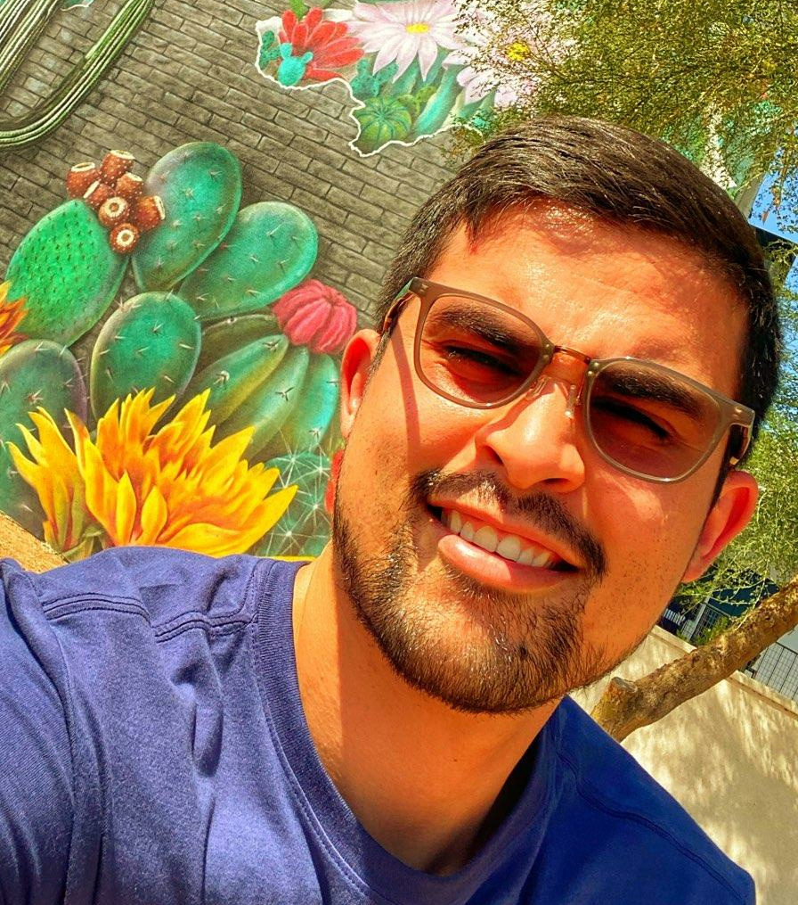

## Welcome!

#### E-mail: <17ruiz17@gmail.com>, <ruizg@ucla.edu>

<!-- #### Office: Math & Sciences Bldg. 8145, University of California - Los Angeles -->

<h1 style="color: #5e9ca0; text-align: center; rotate: 90;"></h1>

I am currently a machine learning engineer at Adobe in San Jose, CA. 

My main areas of interest include causal inference, causal discovery, non-asymptotic statistics, and generally the intersection of machine learning and statistics.

Previously, I was a PhD student in statistics at UCLA (2017-22). My dissertation advisors were [Qing Zhou](http://www.stat.ucla.edu/~zhou/) and [Oscar Madrid Padilla](https://hernanmp.github.io/).

<!-- I received my B.S. in statistics from University of Calfornia, Riverside in 2017 and had the pleasure of working there with [Dr. Subir Ghosh](https://profiles.ucr.edu/subir.ghosh) through the [MARC U program](https://marcu.ucr.edu/).  -->

<!-- A copy of my cv can be found [here](https://github.com/gabriel-ruiz/gabriel-ruiz.github.io/blob/master/cv_public.pdf). -->

### Preprints and Working Papers

<!-- **Structural Equation Modeling** -->

<!-- - **G Ruiz**, OH Madrid-Padilla, Q Zhou. "Scalable causal discovery with tunable exponential or power law tail decay and family-wise error control." **Working Paper**, 2022+. -->

<!-- **Causal Inference** -->
- **G Ruiz**, OH Madrid-Padilla. "Inference with high confidence on the distribution of multi-marker counterfactuals." **Working Paper**, 2022+. 
- **G Ruiz**, OH Madrid-Padilla. "Non-asymptotic confidence bands on the probability an individual benefits from treatment (PIBT)." **arXiv Preprint**, 2022+. [[Link](https://arxiv.org/abs/2205.09094), [Poster](https://github.com/gabriel-ruiz/gabriel-ruiz.github.io/blob/master/ACIC2022_andLatMath2022Poster.pdf)].
- OH Madrid-Padilla, P Ding, Y Chen, **G Ruiz**. "A causal fused lasso for interpretable heterogeneous treatment effects." **arXiv Preprint**, 2021. [[Link](https://arxiv.org/abs/2110.00901)].

### Published/Accepted papers
- **G Ruiz**, OH Madrid-Padilla, Q Zhou. "Sequentially learning the topological ordering of directed acyclic graphs with likelihood ratio scores." **Transactions of Machine Learning Research** (to appear), 2022+. [[Link](https://arxiv.org/abs/2202.01748), [Causal discovery review slides](https://github.com/gabriel-ruiz/gabriel-ruiz.github.io/blob/master/causal_discovery_review___reading_group_10Dec2020.pdf)].
- M Burkhart, **G Ruiz**. "Neuroevolutionary feature representations for causal inference." **International Conference on Computational Science**, 2022. [[Link](https://link.springer.com/chapter/10.1007/978-3-031-08754-7_1), [Slides](https://easychair.org/smart-slide/slide/zmSQ#)]
<!--   -A strategy for Feature Engineering as a pre-processing step to the [R/S/T/X]-Learner frameworks to estimate CATE. -->
- OA Vsevolozhskaya, **G Ruiz**, DV Zaykin. "Bayesian prediction intervals for assessing P-value variability in prospective replication studies." **Translational Psychiatry**, 2017. [[Link](https://doi.org/10.1038/s41398-017-0024-3)]
- OA Vsevolozhskaya, CL Kuo, **G Ruiz**, L Diatchenko, DV Zaykin. "The more you test, the more you find: The smallest Pvalues become increasingly enriched with real findings as more tests are conducted." **Genetic Epidemiology**, 2017. [[Link](https://onlinelibrary.wiley.com/doi/full/10.1002/gepi.22064)]
<!-- - S Ghosh, **G Ruiz**, B Wales. "Subsampled data-based alternative regularized estimators." **Journal of Data Science,** 2020. -->

### Grants: 
NSF GRFP DGE-1650604

### Work Experience
- I received my B.S. in statistics from University of Calfornia, Riverside in 2017 and had the pleasure of working there with [Dr. Subir Ghosh](https://profiles.ucr.edu/subir.ghosh) through the [MARC U program](https://marcu.ucr.edu/).
- I had the pleasure of working for [Dmitri Zaykin](https://scholar.google.com/citations?user=Lk0u83MAAAAJ&hl=en) at the National Institute of Environmental Health Sciences in Research Triangle Park, North Carolina in Summer 2016 on simulation work related to multiple hypothesis testing in genetics. 
- In Summer 2017, I worked at [Draper Laboratory](https://www.draper.com/) in Cambridge, MA with an engineering team in the Perception and Localization group thanks to the [GEM Consortium Fellowship](http://www.gemfellowship.org/students/gem-fellowship-program/). 
- As a repeat data scientist intern at Adobe Inc., I worked on churn classification models and causal modeling in Summers 2019 and 2021, respectively. 

### Teaching
I was a Teaching Assistant at UCLA for Statistics 10: Introductory Statistics (6x), Statistics 100A: Probability with Texas Hold 'Em Examples (1x), [Statistics 100C: Linear Models](http://www.stat.ucla.edu/~nchristo/statistics100C/) (1x), and [Statistics 200C: High Dimensional Statistics](http://www.stat.ucla.edu/~arashamini/teaching/200c) (1x).

#### Miscellaneuous 
- [Some review slides on Causal Discovery.](https://github.com/gabriel-ruiz/gabriel-ruiz.github.io/blob/master/causal_discovery_review___reading_group_10Dec2020.pdf)
<!-- - [What are some ways to find a mentor as an undergrad?](https://github.com/gabriel-ruiz/gabriel-ruiz.github.io/blob/master/howToFindAMentor_RLadiesIrvine%20_15Sept2020_ruizGabriel.pdf) -->
<!-- - [Understanding Predictors of Freshman Enrollment at UC Riverside (undergraduate consulting class project).](https://github.com/gabriel-ruiz/gabriel-ruiz.github.io/blob/master/stat183_project_ruizGabriel.pdf) -->

#### Social Media
[LinkedIn](https://www.linkedin.com/in/gabriel-ruiz-9a2a19b5/)

<!-- [Twitter](https://mobile.twitter.com/gabriel_ruiz001) -->
